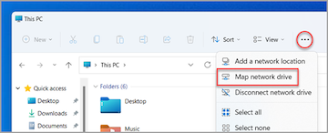
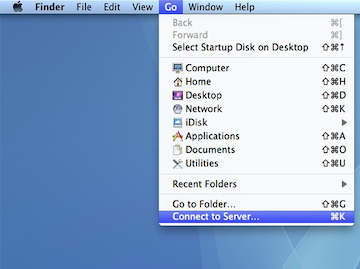
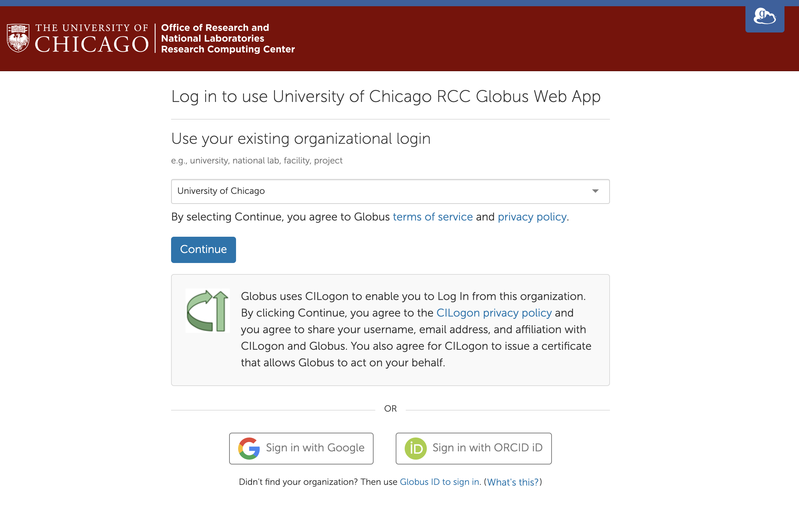
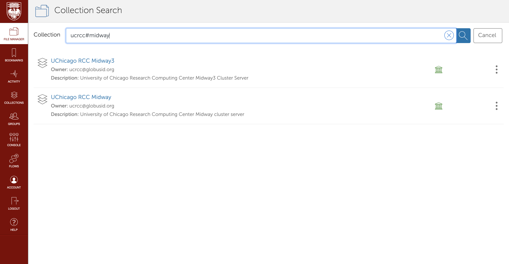

# Transferring Data to Midway

This page provides information on how to transfer data to Midway from your local computer (and vice versa).

The following table summarizes which methods are available and what tasks they are suited for:

|  <div style="width:200px">Transfer Method</div> | Suitable For | Not Suitable For |
| ----------- | ----------- | ----------- |
| Secure Copy (SCP) | Transferring files of no more than a few GB. Terminal users. | Transferring large datasets |
| SAMBA | Transferring files of no more than a few GB. Desktop GUI users. | Transferring large datasets |
| HTTP | Sharing data publically via web with collaborators. | Sharing data with large number of users. Transferring data to Midway via HTTP is not possible. |
| Globus | Transferring large files, datasets, and multiple directories. | Quick data transfer of few files |

## Secure Copy (SCP)

Mac and Linux systems provide a `scp` command which can be accessed from the command line. 

To transfer files from your local computer to your home directory (see [Data Storage](/docs/datastorage.md) for information on directories), open a terminal window and issue the command:  

For single files:
=== "Midway2"
    ```
    scp <some file> <CNetID>@midway2.rcc.uchicago.edu:
    ```
=== "Midway3"
    ```
    scp <some file> <CNetID>@midway3.rcc.uchicago.edu:
    ```
For directories:
=== "Midway2"
    ```
    scp -r <some dir> <CNetID>@midway2.rcc.uchicago.edu:
    ```
=== "Midway3"
    ```
    scp -r <some dir> <CNetID>@midway3.rcc.uchicago.edu:
    ```

To transfer to a directory **other than** your home directory (for example, project):

=== "Midway2"
    ```
    scp -r <some dir> <CNetID>@midway2.rcc.uchicago.edu:/project2
    ```
=== "Midway3"
    ```
    scp -r <some dir> <CNetID>@midway3.rcc.uchicago.edu:/project
    ```

When prompted, enter your CNet password.

## SAMBA

SAMBA allows one to connect to (or “mount”) their home and project directories on their local computer.   

This method of accessing your RCC home and project space is only available from within the UChicago campus network. From off-campus you will need to first **connect through the UChicago VPN.**

**Connecting from Windows**   


{ width="150"}

On a Windows computer, select “Map Network Drive” and enter one of the following UNC paths depending on which location on Midway you wish to connect to:  
=== "Midway2"
    === "Home"
        ```
        \\midwaysmb.rcc.uchicago.edu\homes
        ```
    === "Project2"
        ```
        \\midwaysmb.rcc.uchicago.edu\project2
        ```
    === "Scratch"
        ```
        \\midwaysmb.rcc.uchicago.edu\midway2-scratch
        ```
=== "Midway3"
    === "Home"
        ```
        \\midway3smb.rcc.uchicago.edu\homes
        ``` 
    === "Project"
        ```
        \\midway3smb.rcc.uchicago.edu\project
        ```
    === "Scratch"
        ```
        \\midway3smb.rcc.uchicago.edu\midway3-scratch
        ```

Enter `ADLOCAL\CNetID` for the username and enter your CNet password.  


**Connecting from Mac OS X**   

  

On a Mac OS X computer, select “Connect to Server” (from "Go" dropdown in Finder) and enter one of the following URLs depending on which location on Midway you wish to connect to:  

=== "Midway2"
    === "Home"
        ```
        smb://midwaysmb.rcc.uchicago.edu/homes
        ```
    === "Project2"
        ```
        smb://midwaysmb.rcc.uchicago.edu/project2
        ```
    === "Scratch"
        ```
        smb://midwaysmb.rcc.uchicago.edu/midway2-scratch
        ```
=== "Midway3"
    === "Home"
        ```
        smb://midway3smb.rcc.uchicago.edu/homes
        ``` 
    === "Project"
        ```
        smb://midway3smb.rcc.uchicago.edu/project
        ```
    === "Scratch"
        ```
        smb://midway3smb.rcc.uchicago.edu/midway3-scratch
        ```
Enter `ADLOCAL\CNetID` for the username and enter your CNet password.  


## HTTP
RCC provides web access to data on their storage system via public_html directories in users’ home directories.

| Local path | Corresponding URL |
| ------ | -----------|
| /home/[your_CNetID]/public_html/research.dat | http://users.rcc.uchicago.edu/~[your_CNetID]/research.dat |

Ensure your home directories and `public_html` have the execute permissions.
Optionally, ensure public_html has read permissions if you would like to allow indexing.

You may set these permissions using the following commands:
```
chmod o+x $HOME
mkdir -p $HOME/public_html
chmod o+x $HOME/public_html
// optional; if you would like to allow directory listing.
chmod o+r $HOME/public_html
```
Files in public_html must also be readable by the web user, "other", but should not be made executable.

You may set read permissions for web users/"other" using the following command:
```
chmod o+r $HOME/public_html/research.dat
```

**NOTE**: Use of these directories must conform with the [RCC usage policy](https://rcc.uchicago.edu/about-rcc/rcc-user-policy). Please notify RCC if you expect a large number of people to access data hosted here.

## Globus Online
Globus Online is a robust tool for transferring large data files to/from Midway. RCC has a customized Globus Online login site.

1. Go to https://globus.rcc.uchicago.edu and Select “University of Chicago” for the existing orginizational login:

    { width=1000 }

2. Enter your CNetID and password when prompted

    { width=1000 }

3. You will need to link your University of Chicago credentials to a Globus Online account. Either create a new Globus Online account or sign in to your existing account if you have one.

4. Once you are signed in, select the "File Manager" tab on the sidebar, then enter "ucrcc#midway". You can select "UChicago RCC Midway" to access your Midway 2 files or "UChicago RCC Midway3" to access your Midway 3 files.

    { width=1000 }

5. You will then be able to perform actions such as transfer files, share collections, or create new directories. To learn more about how to use these tools, please refer to the "Help" tab on the left toolbar.

    { width=1000 }

There is extensive documentation on the [Globus Online](https://docs.globus.org/) site as to how to transfer files in different modes. Please refer to their documentation for more details or contact us with any RCC specific issues.