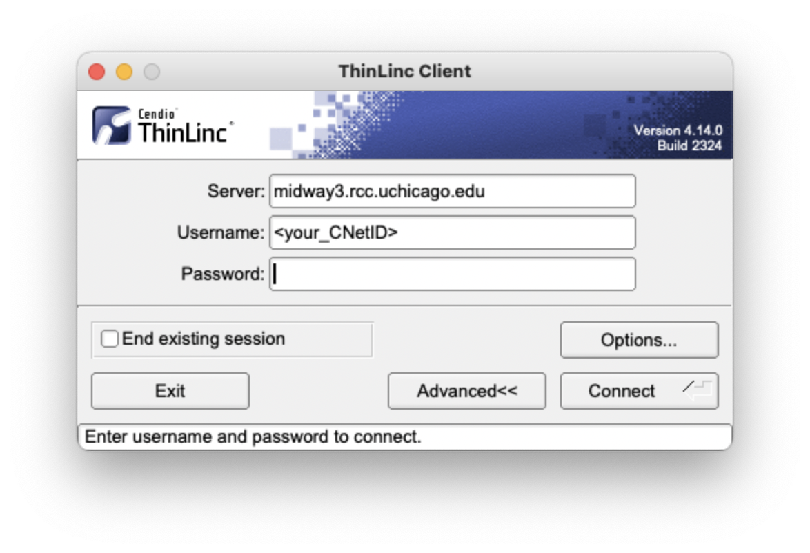
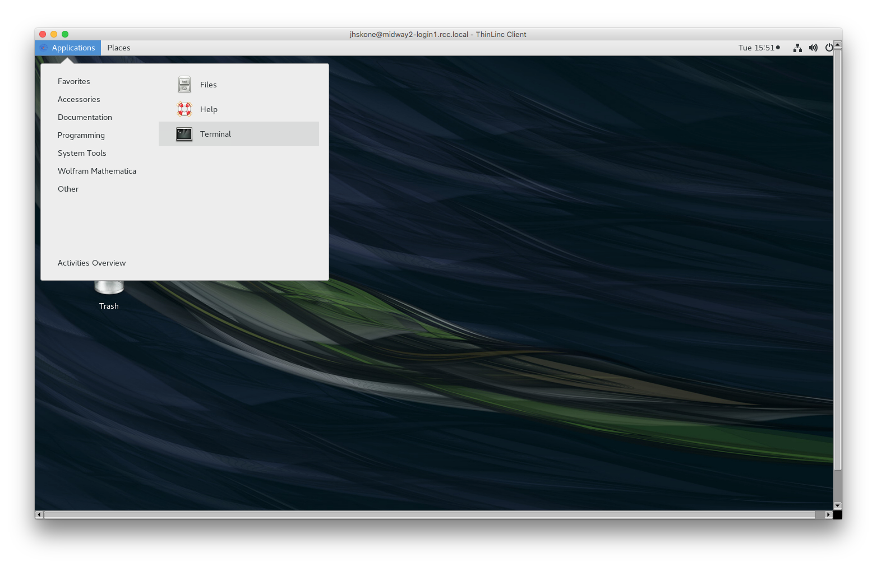

# Connecting to Midway
The information here describes how users can access RCC resources. All users of RCC resources are responsible for knowing and abiding by the [RCC User Policy](/user_policy){:target="_blank"}. 

Upon logging in to Midway, you will be connected to either one of two login nodes on the respective system:
```
Midway2: midway2-login1.rcc.uchicago.edu or midway2-login2.rcc.uchicago.edu
Midway3: midway3-login1.rcc.uchicago.edu or midway3-login2.rcc.uchicago.edu
```

**NOTE**: The login nodes are *NOT* for computionally intensive work. For running computationally intensive programs, see Running jobs on midway (link).

## Account Credentials
To use resources provided by the Research Computing Center you must have a RCC user account. If you do not already have a RCC acount, see the Getting Started page (link) for more information on obtaining a RCC account.

Your RCC account uses your UChicago CNetID for the username and the corresponding CNetID password for the password:

```
Username: CNetID
Password: CNet password
```

**NOTE**: If you require password assistance, please see the CNet Password Recovery webpage or contact UChicago IT Services (link).

## Connecting with SSH
Secure Shell (SSH) is a protocol that provides secure command-line access to remote resources such as Midway.\*

To log in to Midway from a **Linux** or **Mac** computer, open a terminal.

To log in to Midway from a **Windows** computer, open *powershell*.\*\*

At the command line enter:
=== "Midway2"
    ```
    ssh <CNetID>@midway2.rcc.uchicago.edu
    ```
=== "Midway3"
    ```
    ssh <CNetID>@midway3.rcc.uchicago.edu
    ```

Provide your CNetID password when prompted. Duo two-factor autentication will request you select from the available 2FA options to authenticate to Midway.

```
Duo two-factor authentication for user

Enter a passcode or select one of the following options:

1) receive a push code on your Duo app,
2) Receive authentication through your phone number, and
3) get an SMS code.

Passcode or option (1-3):
```

Choose from the available two-factor authentication options and finish the authentication process.

### X11 Forwarding
To enable X11 forwarding when connecting to a Midway system with ssh, the -Y flag should be included:
=== "Midway2"
    ```
    ssh -Y <CNetID>@midway2.rcc.uchicago.edu
    ```
=== "Midway3"
    ```
    ssh -Y <CNetID>@midway3.rcc.uchicago.edu
    ```
**NOTE**: XQuartz is required to enable trusted X11 forwarding on a Mac.

## Connecting with ThinLinc
ThinLinc is a remote desktop server used to connect to Midway and obtain a remote graphical user interface (GUI). We recommend using ThinLinc to use software that requires a GUI.

### Using ThinLinc through a web browser
Point your web browser to the following web address:
=== "Midway2"
    ```
    https://midway2.rcc.uchicago.edu.
    ```
    You will land on this page:
    { width=500 }
=== "Midway3"
    ```
    https://midway3.rcc.uchicago.edu.
    ```
    You will land on this page:
    { width=500 }

Proceed to log in with your CNetID and password.

Duo two-factor autentication will request you select from the available 2FA options to authenticate to Midway.

```
Duo two-factor authentication for user

Enter a passcode or select one of the following options:

1) receive a push code on your Duo app,
2) Receive authentication through your phone number, and
3) get an SMS code.

Passcode or option (1-3):
```

### Using the ThinLinc Desktop Client
Download and install the appropriate ThinLinc client here:
https://www.cendio.com/thinlinc/download

Open the ThinLinc client and use the following information to set up your connection to Midway:

=== "Midway2"
    ```
    Server: midway2.rcc.uchicago.edu
    Username: CNetID
    Password: CNet password
    ```
    Your client should look similar to this:
    { width=500 }

=== "Midway3"
    ```
    Server: midway3.rcc.uchicago.edu
    Username: CNetID
    Password: CNet password
    ```
    Your client should look similar to this:
    { width=500 }
    

ThinLinc will default to open in a fullscreen window that fills `all monitors`. To change this use `Options` from the initial login interface. 

After clicking the `Connect` button, Duo two-factor autentication will request you select from the available 2FA options to authenticate to Midway.

```
Duo two-factor authentication for user

Enter a passcode or select one of the following options:

1) receive a push code on your Duo app,
2) Receive authentication through your phone number, and
3) get an SMS code.

Passcode or option (1-3):
```

### Using ThinLinc's Interface

Upon successfully logging in, you will be presented with an IceWM desktop. Select Applications tab in the top left corner to access the terminal, file browser, and other utilities.

{ width=500 }

To copy/paste between Thinlinc webaccess client and your computer, open the side toolbar by clicking the purple handle. Click the Clipboard icon. The text field that just open will be synced with the clipboard on the server, so you can copy and paste to and from this text field.

With ThinLinc it is possible to maintain an active session after you have closed your connection to Midway. To disconnect from Midway but maintain an active session, simply close the ThinLinc window. 

**NOTE: You must have End existing session unchecked for this to occur.**

To exit ThinLinc and terminate your session completely, simply exit or close the ThinLinc application.

## Remote Visualization on Midway 2
<!-- is this available on Midway 3 as well? -->
RCC provides a mechanism for accessing a GPU-equipped visualization node, which can be used for running 3D and graphics-intensive visualization software packages. 

First log into Midway via ThinLinc.

Once logged in, open a terminal and in the terminal window, issue the command `sviz`

{ width=500 }

To exit the Visualization node, simply close the terminal window from which it was launched. You can then log out of Midway by selecting Logout from the Applications menu in ThinLinc, or by simply closing the ThinLinc window.

<sub> \*\* Windows users running a version of Windows older than Windows 10’s April 2018 release will have to download an ssh client to connect via ssh. We recommend the MobaXterm, client, although other options are available. <sub> 

<sub> \* SSH key-based authentication is no longer supported. The SSH password-based authentication is currently the only supported method for authentication. <sub>