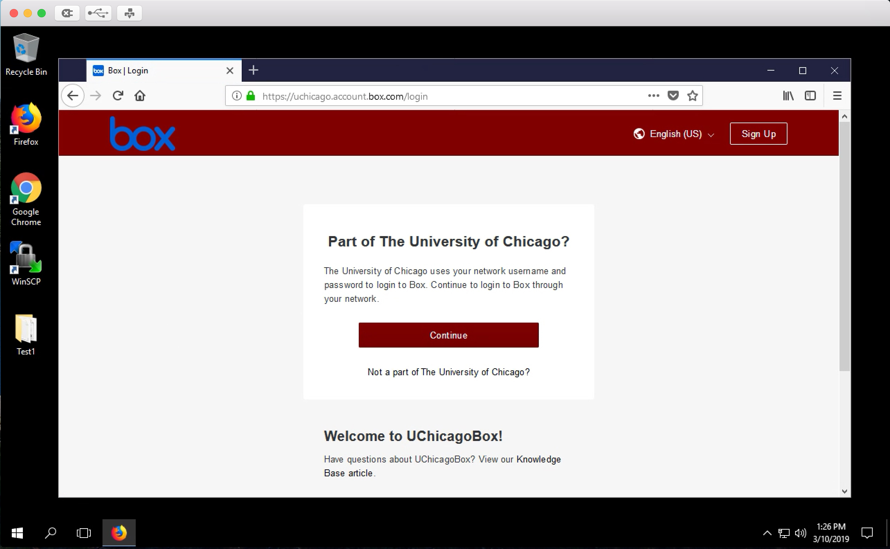
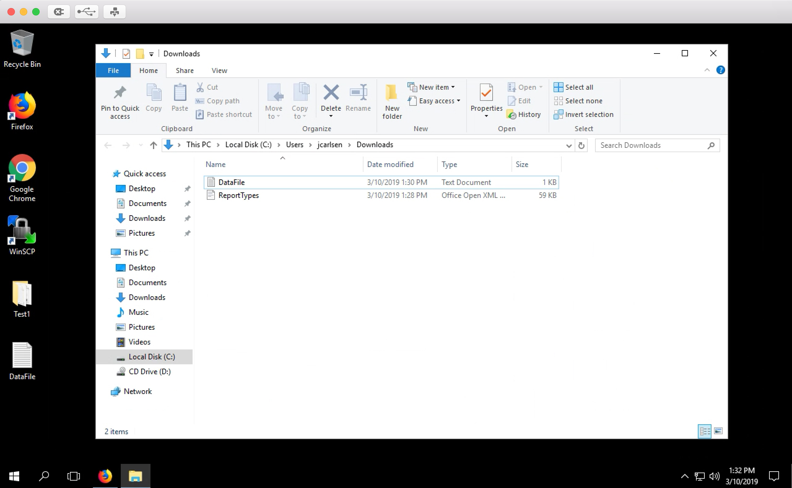
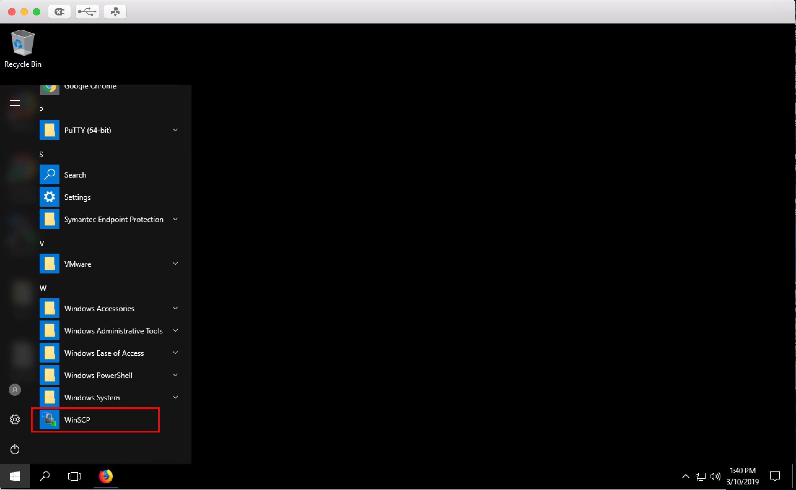
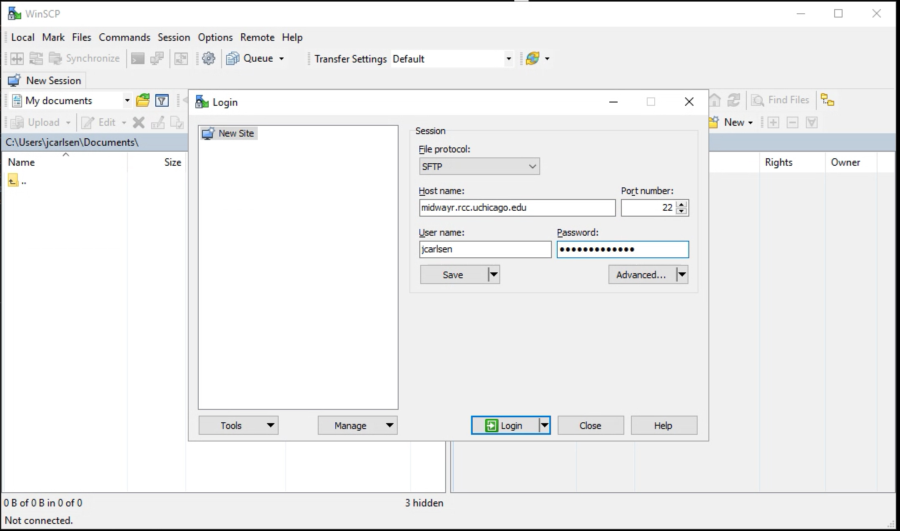

## Transferring Data to the VDI and then WinSCP to MidwayR

### Method #1 (recommended) : Transferring Using UChicago Box from within a VDI browser 		

##### Once you have started the MidwayR Desktop (see [Connecting to the SDE Desktop](../connecting/index.md)), you can open a browser and log in to a Box account at [https://uchicago.account.box.com](https://uchicago.account.box.com/login):  

  

##### Download files into the VDI using the built-in Box Download function :  

  

##### By default it will copy the files into your Downloads folder, e.g. C:\Users\[CNetID]\Downloads :  

  

##### When you've transferred all your files from Box to the VDI, open the WinSCP application :   

  

##### Connect to midwayr.rcc.uchicago.edu with your CNet ID and password :  

  

##### (Add the host key if this is your first time using WinSCP to move files) :  

  

##### Move the folders or files you wish to MidwayR using the Upload function -- please do remember there is a 30GB quota on the home directories and a 500GB quota on project, so we strongly recommend keeping your data in project:  

  

##### You can use PuTTy to connect to MidwayR to confirm the files are there :   

  

#### Please note that any files remaining in the VDI will be removed; please be sure to move all your files to MidwayR.

### Method #2 : Transferring Using a Hardware-Encrypted USB Device

Hardware-encrypted USB drives (available from IT Services at the @TechBar in the Regenstein Library) are recognized by the VDI client, and data can be transferred directly (uploading and downloading) using one of those devices.

### Method #3 : Transferring Using Secure Connections from within VDI

We also envision the possibility that users with the ability to log in to secure systems via a web browser will be able to transfer data directly from a remote secure system.

<!--
### Method #4 : Transfers by RCC System Administrators

RCC Systems Administrators can also move data into a specific directory, but this process requires significant lead time as the data must be analyzed for security threats and verified before transfer.
-->
