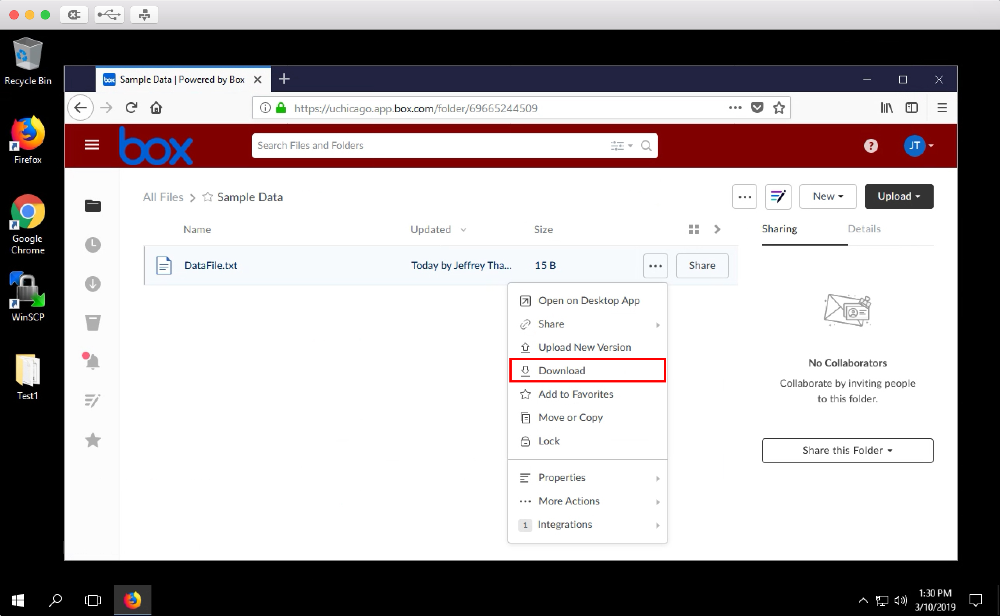

## Transferring Data to the SDE desktop and then to MidwayR3
MidwayR3 has no connection to the internet and can only be accessed by logging into the SDE desktop.  

!!! warning
    Once your login session ends with Azure, all data that was downloaded will be purged from the AVD.

### Method #1 (recommended) : Transferring Using UChicago Box from within the SDE Desktop 		

Once you logged in to the MidwayR3 desktop (see [Connecting to the SDE Desktop](connecting.md)), you can open a browser and log in to a Box account at [https://uchicago.account.box.com](https://uchicago.account.box.com/login):  

  

Download files into the SDE desktop using the built-in Box Download function:  

  

By default it will copy the files into your Downloads folder, e.g. C:\Users\[CNetID]\Downloads:  

  

When you've transferred all your files from Box to the SDE desktop, open the WinSCP application:   

  

Connect to midwayr.rcc.uchicago.edu with your CNet ID and password:  

  

Add the host key if this is your first time using WinSCP to move files:  

  

Move the folders or files you wish to MidwayR3 using the Upload function -- please do remember there is a 30GB quota on the home directories and a 500GB quota (default) on project, so we strongly recommend keeping your data in project:  

  

!!! warning
    Once your login session ends with Azure, all data that was downloaded will be purged from the AVD.

In special cases where you need to transfer more than 30GB, please contact us at midwayr-help@rcc.uchicago.edu. 

### Method #2 : Transferring Using a Hardware-Encrypted USB Device

Hardware-encrypted USB drives (available from IT Services at the @TechBar in the Regenstein Library) are recognized by the AVD client, and data can be transferred directly (uploading and downloading) using one of those devices.

<!--
### Method #3 : Transfers by RCC System Administrators

RCC Systems Administrators can also move data into a specific directory, but this process requires significant lead time as the data must be analyzed for security threats and verified before transfer.
-->
