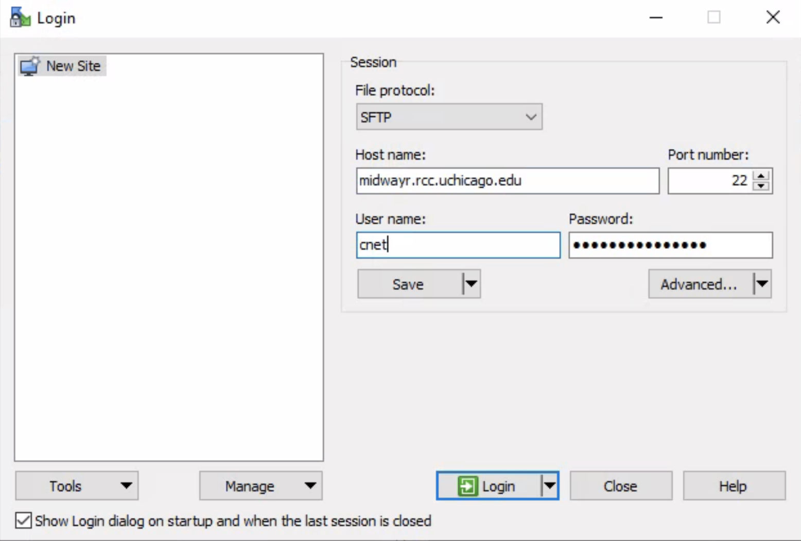

## Quick Overview: Differences Between AVD and Previous VDI
The AVD should feel familiar to you if you have used the previous VDI to connect to MidwayR. There are a few noteworthy differences:

* You no longer need to be connected to the University VPN before connecting to MidwayR. Azure takes care of encrypting and securing all communications between your local computer and the Virtual Desktop.
* You can now connect from your web browser, in addition to the Microsoft Remote Desktop application.
* Your local data storage limit in the SDE desktop is 30GB. Any data stored will be purged when your login session ends.
* It is no longer possible to copy/paste between your local computer and the Virtual Desktop. You can still copy/paste inside the AVD environment.

## Connecting to MidwayR3 is a two-step process:

Accessing MidwayR3 is a two-step process:
1. Login to the Secure Data Enclave (SDE) Desktop using the Azure Virtual Desktop (AVD).
2. Once you are connected to the SDE Desktop, login to MidwayR3 using ThinLinc or an SSH client.

#### Connecting To The AVD From The Web Browser
Navigate to [https://rdweb.wvd.microsoft.com/arm/webclient](https://rdweb.wvd.microsoft.com/arm/webclient) on your computer's web browser.
Select "AVD Host" to launch the Virtual Desktop:

{ width="1000" }

You will be prompted for your username (cnetID@uchicago.edu) and password:

{ width="1000" }

After logging in, you will arrive at the Desktop where you can launch applications:

{ width="1000" }

#### Connecting To The AVD From Microsoft Remote Desktop
You can also connect from the Microsoft Remote Desktop App, available for download on the Windows or MacOS app store.
After launching the app, click on the "+" symbol and select "Add Workspace":

{ width="500" }

In the dialog box, put the URL
"https://rdweb.wvd.microsoft.com":

{ width="700" }

You should then be able to launch the AVD from within the App.

#### Connecting To MidwayR3
Once you are connected to the SDE environment using the AVD client following the steps given above, please follow one of the methods below to connect to MidwayR3 from the SDE environment.

###### Connecting with ThinLinc

ThinLinc is a remote desktop server application. It is recommended to
use ThinLinc when you run a software that requires a graphical user
interface, or "GUI" (e.g., Stata, MATLAB). To use ThinLinc to connect
to MidwayR, please take the following steps:

1. Open a browser (Chrome or Firefox) and enter
   `https://sde.rcc.uchicago.edu` in the address bar.

2. Enter your CNetID and password on the ThinLinc login page:  

  

3. Follow the two factor authentication prompts:  

  

4. If the login process is successful, you will see a Linux desktop
environment. To access the command-line shell, select the Applications
menu, then the Terminal icon:  

  

5. After selecting the Terminal icon, you should see a Terminal window
appear. Typically this will give a console prompt showing which login
node you are connected to, either `sde-login1` or
`sde-login2`:  

  

To exit ThinLinc, type `exit` in any Terminal window, select the
top-right icon, then select the "Log Out" menu item and follow
the instructions. Finally, close the browser window.  
   

## AVD Data Storage and Data Transfer
Once connected to the Azure Desktop, you can open a web browser and download data from, e.g., UChicago Box, placing the data in the Desktop or Documents folder.
There is a 30GB limit per-user for storing files in the AVD.
These files can then be permanently transferred to MidwayR using WinSCP:

{ width="900" }

Once your login session ends with Azure, all data that was downloaded will be purged from the AVD.

In special cases where you need to transfer more than 30GB, please contact us at midwayr-help@rcc.uchicago.edu . 

## Logging Out
You can log out of the AVD by clicking the "Log off" application on the Desktop.
Once logged off, any data stored in your AVD user-space will be purged.
