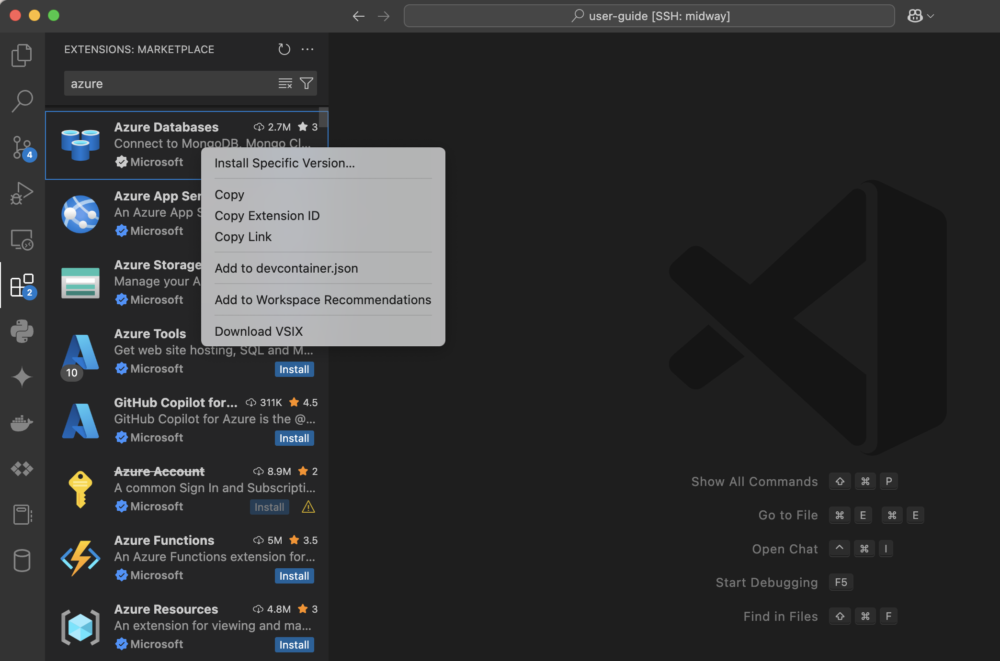
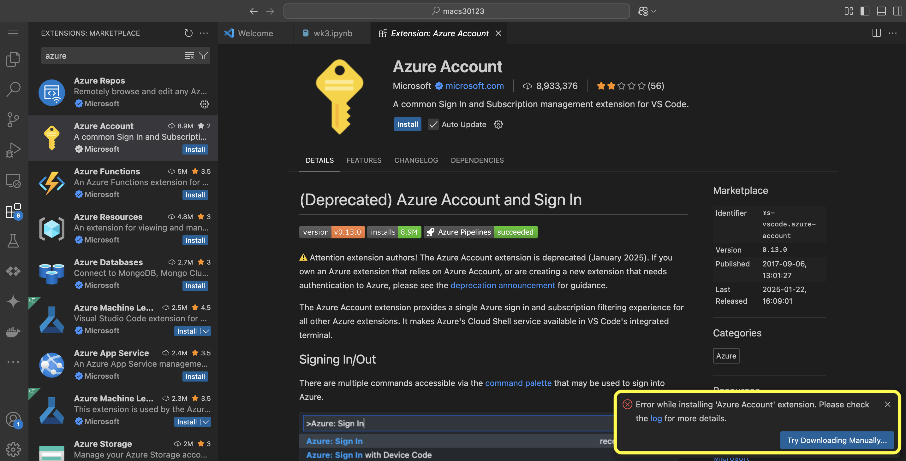
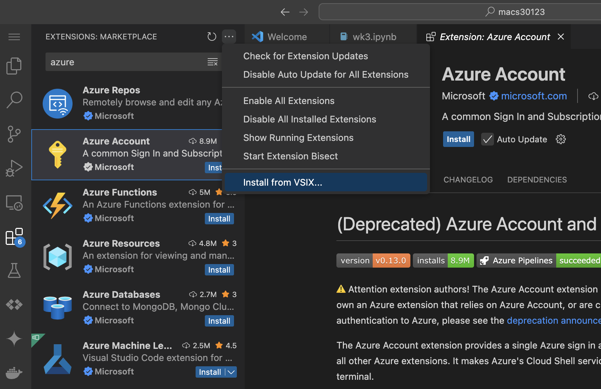

# Managing Extensions in `scode`

This guide explains how to manage Visual Studio Code extensions in server-based VSCode environments launched with `scode`. Extensions are critical for productivity, and there are multiple ways to install them depending on your workflow.

---

## Option 1: Install Extensions via the VSCode Web UI

This is the recommended method for installing a few extensions manually. If a large number of extensions are needed, consider using [Option 2](#option-2-install-extensions-via-cli) and [Option 3](#option-3-porting-extensions-from-an-existing-vscode-installation).

### Step 1: Download the Extension (.vsix)

**Method A**: From local VSCode

1. Open VSCode on your local machine
2. [Optional] Connect to the Midway cluster via SSH
3. Go to the **Extensions Panel** (left sidebar)
4. Search for the desired extension (e.g., `Python`, `Jupyter`)
5. Right-click the extension and select **"Download VSIX"** to save the `.vsix` file locally.

{: class="responsive-img"}

**Method B**: From the VS Code Server Web UI

1. Open your VSCode Web UI in the browser
2. Go to the **Extensions Panel**
3. Search for the desired extension
4. Click the **Install**. VSCode will complain that an internet error prevented a successful installation.
5. Click the **"Try Downloading Manually..."** link to download the `.vsix` file to your local machine.

{: class="responsive-img"}

### Step 2: Transfer the Extension to the Server

If you downloaded the `.vsix` file to your local machine, you will need to transfer it to the Midway cluster:

**Method A**: Drag and drop the local `.vsix` file to the VSCode UI.
**Method B**: Use `scp` to copy the file to the cluster.

```bash
scp path/to/vsix/file <yourusername>@<midway_ssh_host>:~
```

### Step 3: Install from VSIX

1. Open your VSCode Web UI in the browser
2. Go to the **Extensions Panel** (left sidebar)
3. Click the **three-dot menu (⋮)** in the top-right corner of the panel
4. Choose **"Install from VSIX"**, and select the file from your home directory

{: class="responsive-img"}

---

## Option 2: Install Extensions via CLI

If you are automating setup or managing multiple environments, you can use the `scode` CLI:

```bash
scode ext install ms-python.python ms-toolsai.jupyter
```

You can use the `--env` option to specify the environment name (e.g., `default`).

To list environments or identify the current environment:
```bash
scode list
```

---

## Option 3: Porting Extensions from an Existing VSCode Installation

If you have a local setup with useful extensions, you can export and re-import them in the server environment.

### Step 1: Export locally

On your **local machine**:
```bash
code --list-extensions > extensions.txt
```

An example `extensions.txt` file might look like this:
```
ms-python.python
ms-toolsai.jupyter
ms-vscode.cpptools
...
```

If you are using VSCode Insiders:
```bash
code-insiders --list-extensions > extensions.txt
```

If you need specific versions of extensions, you can modify the file to include version numbers like this:
```
code --list-extensions --show-versions > extensions.txt
```

### Step 2: Upload to the cluster

You can manually copy the contents of `extensions.txt` to the Midway cluster, or use `scp`:

```bash
scp extensions.txt yourusername@midway3.rcc.uchicago.edu:~
```

### Step 3: Bulk install in server environment
```bash
scode ext install -f extensions.txt
```

This command installs all extensions listed in the file.

---

## Additional Commands

### List installed extensions

```bash
scode ext list
```

### Update all extensions

```bash
scode ext update
```

### Uninstall extensions

```bash
scode ext uninstall ms-python.python ms-toolsai.jupyter
```

---

## Notes

- Always confirm you are working in the correct environment, use `--env` option if you wish to interact with a specific environment.
- For more help, run `scode ext --help`.
