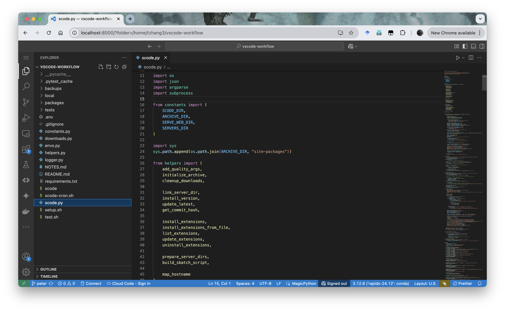

# Getting Started with `scode`

Due to security considerations, compute nodes on Midway do not have direct Internet access, making it infeasible for VSCode clients to connect via SSH, and also particularly challenging to set up a personal VSCode server on them.

To meet the growing demand for interactive development, RCC provides `scode`: a command-line utility that allows users to securely launch, manage, and access VSCode Web sessions running entirely on compute nodes from their browser.

{: class="responsive-img"}

With `scode`, users can continuously prototype, debug, and develop HPC applications without the need to repeatedly submit sbatch jobs. Workflows that involve interactive development—such as model training, data exploration, and performance tuning—can be performed more efficiently and with immediate feedback.

This guide provides a minimal and reliable workflow to help you get started with a VSCode Web session, monitor its status, and connect securely from your local machine.

---

## Quick Start

| Steps                          | Commands                                                                         |
| ----------------------------- | ------------------------------------------------------------------------------- |
| Load SCode module             | `module load scode`                                                             |
| Launch VSCode Server             | `scode serve-web -- --account <pi-account> --time 01:00:00 --mem 16G` |
| List jobs and get job ID     | `scode jobs list`                                                               |
| Check status and get conncection instructions | `scode jobs status <job_id>`                                                    |
| Cancel a job                  | `scancel <job_id>`                                                              |


---

## Step 1: Load `scode` Module

Before using `scode`, load the module in your terminal:

```bash
module load scode
```

This will activate the `scode` command in your environment. You can add this command to your `.bashrc` or `.bash_profile` for automatic loading in future sessions.

```bash
echo "module load scode" >> ~/.bashrc
source ~/.bashrc # Reload the shell configuration
```

---

## Step 2: Launch a VS Code Server

Once the module is loaded, you can submit a job to start a VSCode Web server. Run the following command from your login node:

```bash
scode serve-web -- --account <pi-account> --time 01:00:00 --partition caslake --mem 16G
```

- `<pi-account>`: Replace this with the name of your PI or course account. You can usually find this via your SLURM allocation or ask your advisor.
- Additional slurm options can be added to the `scode serve-web` command after the `--` separator. Refer to [Slurm User Guide](/slurm/sbatch/) and [Sbatch Documentation](https://slurm.schedmd.com/sbatch.html) for more details on job submission options.

This command will:

- Submit a SLURM job to run the VSCode Web server
- Prepare the environment and server installation automatically
- Return the job ID and logging paths

Example output:

```
Submitting SBATCH to serve VSCode environment.

Submitted batch job 30317404

sbatch: Verify job submission ...
sbatch: Using a shared partition ...
sbatch: Partition: caslake
sbatch: QOS-Flag: caslake
sbatch: Account: pi-account
sbatch: Verification: ***PASSED***

SBATCH job /home/yourusername/.scode/sbatches/scode-web_20250409_101953.sbatch submitted successfully.
Output will be directed to /home/yourusername/.scode/logs/scode-web_30317404.out.
Errors will be directed to /home/yourusername/.scode/logs/scode-web_30317404.err.
VSCode server is starting with Slurm Job ID 30317404.
Use `scode jobs status 30317404` to check the status of the server.
Use `scancel 30317404` to cancel the server job.
```

---

## Step 3: Check Job Status

To view active VSCode Web jobs:

```bash
scode jobs list
```

To check the status of a specific job and retrieve connection details, use the job ID returned from the previous step:

```bash
scode jobs status 30317404
```

If the job is running, you will receive detailed connection instructions.

Example output:

```
VSCode job 30317404 is running on 1 nodes: midway3-0024
Primary node: 10.50.250.24
Environment: /home/yourusername/.scode/envs/stable/default


To connect to the VSCode Web GUI you need to create an SSH tunnel from your local machine to the primary node above. This can be done with the following command to be run on your local machine (e.g., PowerShell in Windows):

    ssh -L 8000:10.50.250.24:61028 yourusername@midway3.rcc.uchicago.edu

Once the tunnel is created, you may access the VSCode Web GUI by entering the following address in your browser:

    http://localhost:8000/?tkn=f1c72d89-4a5e-43d2-ae1b-9b8237dce021

Server outputs are being written to /home/yourusername/.scode/logs/scode-web_30317404.out.
Server errors are being written to /home/yourusername/.scode/logs/scode-web_30317404.err.
You may use `squeue -j 30317404` to see more information about this job, or cancel it with `scancel 30317404`.
```

In this output:

- `8000` is a port on your local machine. All traffic to this port will be forwarded to the remote VSCode Web server with SSH tunnel. You can change this port if it is already in use.
- `61028` is the port on the remote server where the VSCode Web server is running, which is randomly assigned by SCode.

---

## Step 4: Create an SSH Tunnel from Your Local Machine

On your **local machine**, open another terminal, and run the SSH command shown in the job status output. For example:

```bash
ssh -L 8000:10.50.250.24:61028 yourusername@midway3.rcc.uchicago.edu
```

This command creates a secure channel between port `8000` on your local computer and the remote VSCode Web server running inside the cluster.

- Be sure to use the IP address and port number from your actual job output.
- Use a different local port if `8000` is already in use.

**Keep this terminal open** while you are working inside the VSCode Web session. Closing the tunnel will interrupt your connection.

---

## Step 5: Access VSCode in Your Browser

Once the SSH tunnel is active, follow the link from `scode jobs status`:

```
http://localhost:8000/?tkn=f1c72d89-4a5e-43d2-ae1b-9b8237dce021
```

Modify port `8000` if you used a different local port in `Step 4`.

You will be redirected to a fully functional VSCode Web interface running on the cluster, within your compute environment.

---

## Step 6: Ending the Session

When you are done:

- Close the browser tab (to avoid dangling temp files in your home directory)
- Optionally cancel the SLURM job manually to avoid resource misuse:

```bash
scancel 30317404
```

If not manually cancelled, the job will terminate when the time limit expires.

Now you can close the SSH tunnel terminal as well.

---

## Notes

- Preferably use the SSH tunneling command from your **local machine**, not from within the cluster.
- Port `8000` on your local system must be free; change it in the `ssh -L` command if needed.
- If no server info is available, wait a few moments and run `scode jobs status <job_id>` again.
- For more help, run `scode --help` and `scode <command> --help`.
