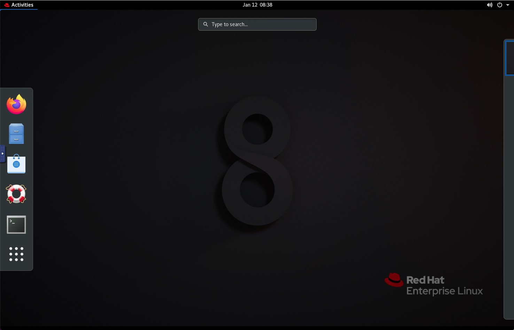
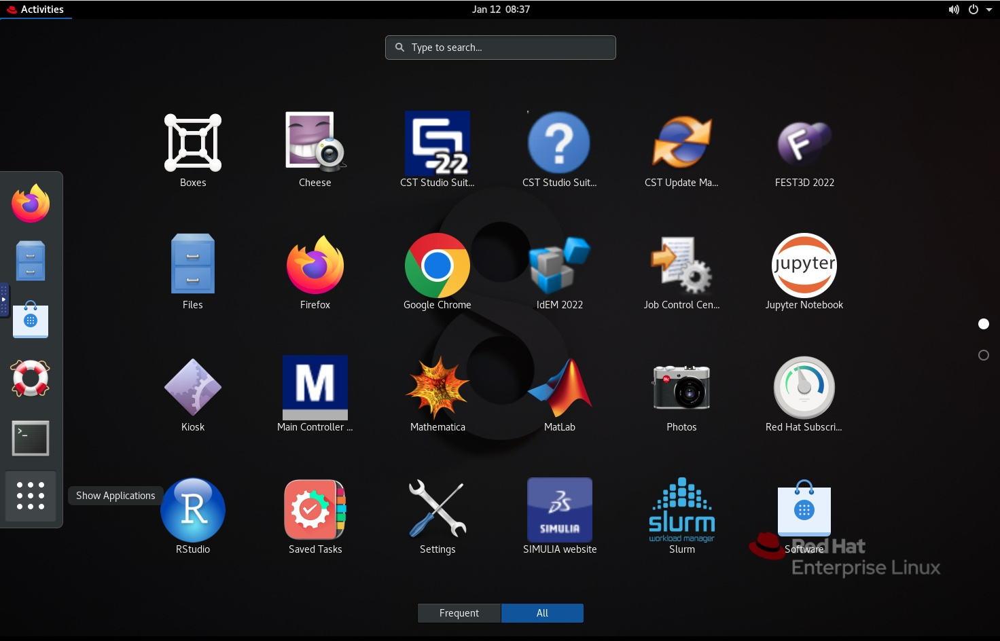
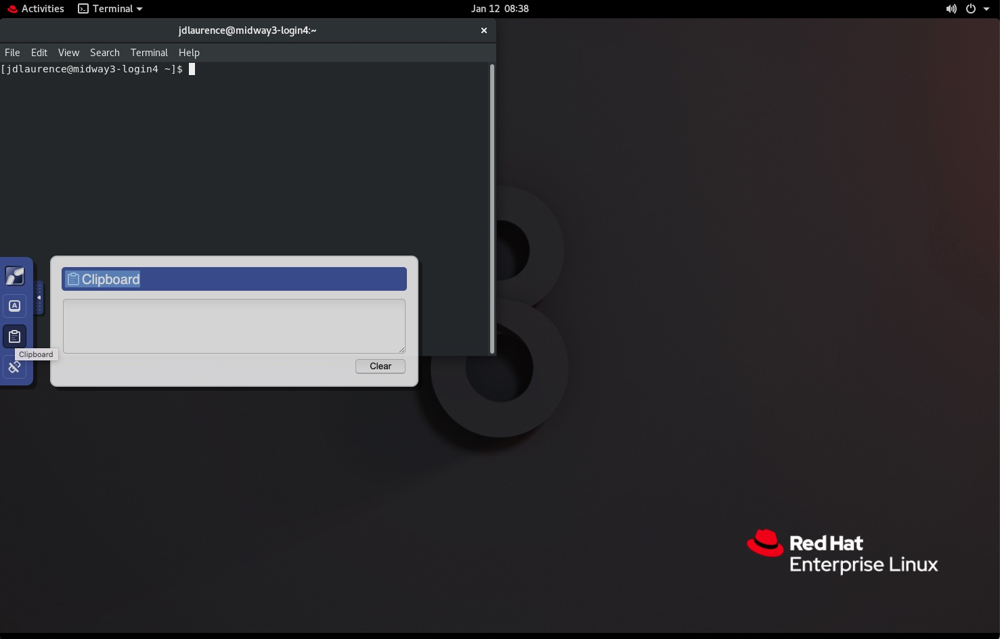
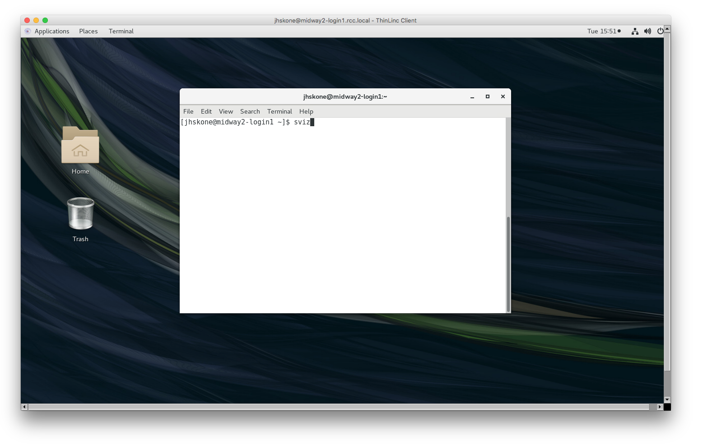

# ThinLinc - Remote Desktop 
## Connecting with ThinLinc
ThinLinc is a remote desktop server used to connect to Midway and obtain a remote graphical user interface (GUI). We recommend using ThinLinc to use software that requires a GUI.

### ThinLinc Web Browser   
Point your web browser to the following web address:
=== "Midway2"
    ```
    https://midway2.rcc.uchicago.edu.
    ```
    You will land on this page:
    { width=500 }
===+ "Midway3"
    ```
    https://midway3.rcc.uchicago.edu.
    ```
    You will land on this page:
    { width=500 }

Proceed to log in with your CNetID and password.

Duo two-factor autentication will request you select from the available 2FA options to authenticate to Midway.

```
Duo two-factor authentication for user

Enter a passcode or select one of the following options:

1) receive a push code on your Duo app,
2) Receive authentication through your phone number, and
3) get an SMS code.

Passcode or option (1-3):
```

### ThinLinc Desktop Client
Download and install the appropriate ThinLinc client here:ß
https://www.cendio.com/thinlinc/download

Open the ThinLinc client and use the following information to set up your connection to Midway:

=== "Midway2"
    ```
    Server: midway2.rcc.uchicago.edu
    Username: CNetID
    Password: CNetID password
    ```
    Your client should look similar to this:
    { width=500 }

===+ "Midway3"
    ```
    Server: midway3.rcc.uchicago.edu
    Username: CNetID
    Password: CNetID password
    ```
    Your client should look similar to this:
    { width=500 }
    

ThinLinc will default to open in a fullscreen window that fills `all monitors`. To change this use `Options` from the initial login interface. 

After clicking the `Connect` button, Duo two-factor autentication will request you select from the available 2FA options to authenticate to Midway.

```
Duo two-factor authentication for user

Enter a passcode or select one of the following options:

1) receive a push code on your Duo app,
2) Receive authentication through your phone number, and
3) get an SMS code.

Passcode or option (1-3):
```

## The ThinLinc Interface

Upon successfully logging in via ThinLinc, you will be connected to a login node and presented with a desktop interface. Select Applications tab in the top left corner to access the terminal, file browser, and other utilities.

{ width=700 }

To view all available applications, click the 3x3 dot grid on the bottom of the Activties Tab:

{ width=700 }

To copy/paste text between your computer and ThinLinc (when copying code into the Terminal, for example), open the side toolbar by clicking the small blue handle. Click the Clipboard icon. The text field that just open will be synced with the clipboard on the server, so you can copy and paste to and from this text field.

{ width=700 }

With ThinLinc it is possible to maintain an active session after you have closed your connection to Midway. To disconnect from Midway but maintain an active session, simply close the ThinLinc window. **You must have "End existing session" unchecked for this to occur.**

To exit ThinLinc and terminate your session completely, simply exit or close the ThinLinc application.

<!-- Deprecated??

## Remote Visualization on Midway2

RCC provides a mechanism for accessing a GPU-equipped visualization node, which can be used for running 3D and graphics-intensive visualization software packages. 

First log into Midway via ThinLinc.

Once logged in, open a terminal and in the terminal window, issue the command `sviz`

{ width=500 }

To exit the Visualization node, simply close the terminal window from which it was launched. You can then log out of Midway by selecting Logout from the Applications menu in ThinLinc, or by simply closing the ThinLinc window.
-->

